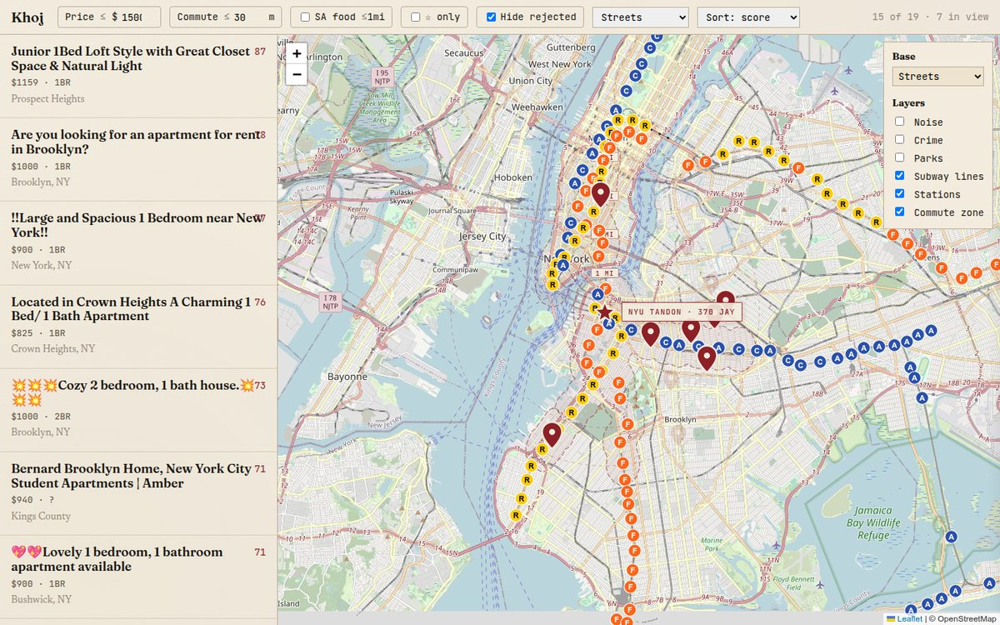

<div align="center">

# Khoj

**A decision-support tool for renting an apartment in Brooklyn.**

Listings sites are built to keep you browsing. This one is built to help you decide: by pulling commute, safety, noise, and food-access data into the same view as the listing itself.

[**Open the live report &rarr;**](https://animeshux.github.io/khoj/)

[](https://github.com/animeshUX/khoj/actions/workflows/scrape.yml)
[](https://github.com/animeshUX/khoj/actions/workflows/secrets.yml)
[](LICENSE)
[](#status)

<br>



</div>

---

## Why this exists

Apartment-listing sites optimize for time-on-site, not time-to-decision. The cues they make salient (photos, asking rent) aren't the cues that actually predict whether you'll be okay there for a year. Whether you sleep at night, how long you spend on the train, whether the precinct ran 200 felonies last year, whether the nearest grocery stocks anything you cook with: that's the data that should be on the listing, and it isn't.

It's all public. NYC 311 logs noise complaints. NYPD CompStat publishes precinct crime monthly. OpenStreetMap knows where the halal markets are. The MTA publishes every station. The data lives in five different APIs, and nobody joins them per-listing because the audience per listing is too small to justify the work.

Khoj does the join. For one renter. Daily. Against one campus.

> [!NOTE]
> <a id="status"></a>**Status: early alpha.** A personal tool, published openly. The campus address and budget live in `scraper.py`: fork the constants to point it at yours. UX bugs in active triage; [Issues tab](https://github.com/animeshUX/khoj/issues) is the place.

## What you see

Three panes, each doing one job:

- **List rail (left)**: the comparison surface. Sortable by score, price, commute, posted-date; no single sort is the source of truth.
- **Map (right)**: the spatial encoding. Pins colored by fit-score, campus marked with a crimson star, F/A/C/R subway stations as MTA bullets. Six toggleable overlays (noise, crime, parks, the 30-minute commute zone, subway lines, subway stations) and eight free tile providers.
- **Detail panel**: the deep read, only when summoned. Commute breakdown, 12-month safety stats, 311 noise counts, ranked Indian restaurants &le; 1 mi, halal / desi groceries.

**Annotations:** **&starf; Star** the good ones, **&#x2298; Hide** the bad, **note** any. Per-device, `localStorage`. &nbsp;&middot;&nbsp; **Keyboard:** `j`/`k` next/prev, `s` star, `h` hide, `Esc` close panel, `/` focus price filter.

## How a renter actually decides

Empirically, housing decisions run in two stages (Payne, Bettman & Johnson, *The Adaptive Decision Maker*, 1993).

**Stage 1: narrow.** A handful of non-negotiable rules: *under $1,500. Not further than 30 minutes. Not a basement. Posted this month.* Each rule is a knockout, applied cheaply because each is one variable. Most listings die here. This stage is **non-compensatory**: a great kitchen doesn't compensate for a 90-minute commute.

**Stage 2: rank.** Among the survivors, the renter trades attributes against each other: *closer but louder. Cheaper but no laundry. Bigger but on the third floor.* This stage is **compensatory** (tradeoffs are allowed), and it's where renting actually gets decided. It's also where renters fall apart. Holding five dimensions across eight candidates in working memory exceeds capacity (Miller's 7&plusmn;2 isn't even close once each candidate has its own row of attributes), so they default to the most salient cue (photos) or the first listing they saw (anchoring), and call that the choice.

**Khoj is built around this two-stage shape.** The hard filters in `scraper.py` do the narrowing. Everything else (the score, the side-by-side layout, the keyboard triage, the persistent stars and hides) exists to keep the renter in Stage 2 long enough to make a deliberate call instead of defaulting to vibes.

The irreducible affective parts (the vibe of the block at sunset, the hallway's smell, the landlord's tone) are not what Khoj is for. It absorbs the legible work so the renter's remaining attention can go to those.

## Design decisions

The interesting work isn't the scraping. It's choosing *what to count* and *how to present it* so a tired renter at 11 PM can stay in compensatory mode and make a real call. Each row below is a design move tagged with the stage it supports.

| Stage | Decision | Why |
|---|---|---|
| Narrow | **Hard filters at scrape time** (price band, beds, recency, ~30-min radius) | Stage 1 is cheap; do it once, upstream, so working memory never has to. |
| Narrow | **Submitted listings bypass the filters** | If a human cared enough to send it, the cost of *not* seeing it exceeds the cost of seeing a noisy match. Override is a first-class action. |
| Rank | **One screen, three panes** (list / map / detail) | Compensatory tradeoffs need every dimension visible at once. Tabs would force serial recall and surface the strongest cue. |
| Rank | **Score-colored map pins**, muted gray &rarr; crimson | Spatial information scent. The ranker's output is encoded in the same view as geography, so location and fit collapse into one read. |
| Rank | **Hover a row &rarr; the pin lights up** | Eliminates the mode-switch tax between the sortable list and the spatial map. They're two projections of one set, not two interfaces. |
| Rank | **Stars / hides / notes in `localStorage`** | Compensatory ranking happens over days, not minutes. Externalize the in-progress mental model so a returning renter doesn't re-evaluate from scratch. |
| Rank | **Hides are sticky** | A ruled-out listing reappearing every morning forces the renter to re-do Stage 1 on it. Pay the elimination cost once. |
| Rank | **Keyboard-first triage** (`j` `k` `s` `h`) | Mouse triage of 30 candidates is a dexterity tax that drains the budget for the actual decision. Power-user affordance, default UI unchanged. |
| Rank | **The score is legible**: weights are constants at the top of `score.py` | A weighted-sum ranker is a personal artifact. Letting the user read the weights makes them editable; if safety isn't your top concern, set it to zero. |
| Rank | **Missing inputs are skipped, not zeroed** | Imputing zeros punishes listings for what we couldn't fetch and pollutes the ranking. Honest uncertainty beats false precision. |
| Meta | **No login, no account, no telemetry** | Sunk cost on data entry is zero. The tool can be abandoned for free if it doesn't earn its place, which is the only honest way to publish a personal decision aid. |

The score is a heuristic ranker, not a recommendation. It prunes attention; you make the call.

## Stage 1: the hard filters

The non-negotiables. Applied in `scraper.py` to the Craigslist scrape; anything that fails them never enters the candidate set.

**$800 &ndash; $1,500** &nbsp;&middot;&nbsp; studio / 1BR / 2BR &nbsp;&middot;&nbsp; posted within two weeks &nbsp;&middot;&nbsp; geodesic &le; 4 mi from campus (a 30-min commute proxy)

Human-submitted URLs bypass these: an explicit override of Stage 1 by a person who took the time to flag the listing.

## Stage 2: the fit-score

A 0&ndash;1 weighted-sum ranker over the survivors, computed in `score.py`. Four attributes; each one is a personal preference, not a fact about apartments.

| Weight | Attribute | Mapping |
|---:|---|---|
| 0.35 | Commute | Listing &rarr; nearest relevant subway &rarr; campus. 15 min &rarr; 1.0, 45 min &rarr; 0.0. |
| 0.25 | Safety | NYPD CompStat felonies, precinct, 12 mo. &le; 20 &rarr; 1.0, &ge; 200 &rarr; 0.0. |
| 0.20 | South-Asian access | &ge; 1 grocery + &ge; 3 close Indian restaurants &rarr; 1.0; partials &rarr; 0.7 / 0.4 / 0.0. |
| 0.20 | Price | &le; $800 &rarr; 1.0, &ge; $2,000 &rarr; 0.0. |

The 0.35 / 0.25 / 0.20 / 0.20 split is one renter's preference. Missing components are skipped from the mean, not zeroed: a listing without enrichment scores on what's known. Edit the constants at the top of `score.py` for your own weighting.

## Submitting a listing you found yourself

Three intake paths, all feeding the same enrichment pipeline:

1. **Google Sheet**: add a row to the shared sheet. Template in [`submissions/template.csv`](submissions/template.csv). An Apps Script web app exposes the sheet as CSV; the scraper reads it via the `KHOJ_SUBMISSIONS_URL` repo secret. The script also resolves rich-text hyperlinks and pre-fetches OpenGraph metadata so listings on Amber / StreetEasy / PadMapper get titles even though those sites block scraping from datacenter IPs. See [`tools/apps_script.gs`](tools/apps_script.gs).
2. **Obsidian Web Clipper**: clip any listing page in your browser; the markdown lands in `submissions/*.md` and the scraper picks it up next run. See [`submissions/README.md`](submissions/README.md).
3. **Local CSV**: `submissions.csv` at the repo root (gitignored), same columns as the template. Useful for local testing.

Trigger a fresh run without waiting for tomorrow: **Actions &rarr; "Scrape Craigslist" &rarr; Run workflow**. The live page updates ~5 minutes later.

## How it runs

Three GitHub Actions workflows, one Python package, a static `docs/` directory served by Pages. **No database. No API keys. No hosting bill.**

- **`scrape.yml`**: daily at ~9 AM Eastern. Scrapes Craigslist, reads sheet + Web Clipper submissions, geocodes via Nominatim, enriches with NYC Open Data (311 noise, NYPD crime) and Overpass (Indian food, halal grocery), writes `docs/index.html` + a dated archive.
- **`overlays.yml`**: weekly. Refreshes `docs/data/crime.geojson` from NYPD CompStat.
- **`secrets.yml`**: on every push and PR. Gitleaks against the full history.

<details>
<summary><b>Code layout</b></summary>

```
scraper.py          orchestrator: scrape + read submissions + geocode + enrich + score
submission.py       parse Web Clipper .md frontmatter + body -> Listing dict
enrich.py           geocode + commute + 311 noise + NYPD crime + Overpass POIs (cached)
score.py            0-1 fit score from the enrichment block

report/             render tier (Python package, imported by scraper.py)
  build.py            write_html(listings, path)
  payload.py          builds window.KHOJ -- the data contract for the browser
  template.py         HTML shell
  __main__.py         `python -m report` for local re-render without re-scraping

docs/khoj/          browser tier (ES modules + CSS)
  main.js             entry -- wires the modules together
  state.js            pub-sub store with localStorage persistence
  map.js              Leaflet init, listing pins, campus star, tile picker, layers control
  list.js             left rail rows, sort, hover-sync with pins
  panel.js            slide-in detail panel
  filters.js          top-bar filter chips + applyFilters()
  overlays.js         6 toggleable overlays + commute path + POI icons on selection
  keys.js             j/k/s/h/Esc//  shortcuts
  khoj.css            all styles (cream-paper editorial theme, design tokens)

docs/data/          pre-computed static GeoJSON overlays
tools/              one-off / weekly build scripts + apps_script.gs
```

</details>

<details>
<summary><b>Run it locally</b></summary>

```bash
python -m venv .venv && source .venv/bin/activate
pip install -r requirements.txt

python scraper.py --sanity-check     # quick check Craigslist is reachable
python scraper.py                    # writes apartments_YYYY-MM-DD.{csv,html}
python scraper.py --pages-mode       # writes into docs/ the same way the Action does
python -m report                     # re-render docs/index.html from the existing payload
                                     # (useful when iterating on CSS/JS without re-scraping)
python -m pytest tests/ -v           # unit tests (score.py + payload.py)
```

If `--sanity-check` 403s, run `python scraper.py --diagnose` to see which Craigslist endpoints are blocked from your network. Usually means a VPN or corporate Wi-Fi.

</details>

<details>
<summary><b>Self-host (fresh fork)</b></summary>

1. **Settings &rarr; Pages** &rarr; Source: "Deploy from a branch" &rarr; Branch: `main`, Folder: `/docs` &rarr; Save
2. **Settings &rarr; Actions &rarr; General** &rarr; Workflow permissions &rarr; "Read and write permissions" &rarr; Save
3. **Actions tab &rarr; "Scrape Craigslist" &rarr; Run workflow** to kick off the first run
4. (Optional) **Settings &rarr; Secrets and variables &rarr; Actions** &rarr; add `KHOJ_SUBMISSIONS_URL` pointing at your Apps Script Web App

After ~5 minutes you'll have a live URL at `https://<your-github-handle>.github.io/khoj/`.

</details>

<details>
<summary><b>Things to know</b></summary>

- **Craigslist blocks the RSS endpoint** from most networks. We parse the static HTML search page instead; works fine from GitHub's runners.
- **1.5-second pause** between Craigslist requests so we don't hammer their servers. ~100 listings takes about 5 minutes.
- **Listings without coordinates** still show up in the list rail (they just don't get a map pin).
- **The cron is idempotent.** Re-running regenerates today's output; nothing accumulates.
- **Geocoding is cached on disk** (`.cache/geocode.json`, gitignored). SODA / Overpass enrichments are cached by week.

</details>

## Where the data comes from

| Layer | Source | What for |
|---|---|---|
| Listings | Craigslist Brooklyn static HTML | the candidate set |
| Submissions | Google Sheet (via Apps Script) + Obsidian Web Clipper | human-curated candidates |
| Geocoding | Nominatim (OSM) | listing &rarr; lat/lng + neighborhood |
| Commute | local `subway-stations.geojson` + haversine + speed assumption | walk + rail estimate to campus |
| Noise | NYC 311 SODA, 250m / 12 mo | ambient-noise complaint count |
| Crime | NYPD CompStat SODA, 400m / 12 mo | precinct safety profile |
| POIs | Overpass (OSM) | Indian / halal / desi food and grocery |

Everything is free and public. No keys.

## Other places worth checking by hand

The report covers Craigslist + manual submissions. Linked at the bottom of every report page:

- [**AmberStudent**](https://amberstudent.com/places/search/new-york-university-1811221663188): purpose-built student housing (per-room, booking-style)
- [**StreetEasy**](https://streeteasy.com/for-rent/brooklyn/price:800-1500%7Cbeds%3C=2): NYC's biggest rental marketplace
- [**PadMapper**](https://www.padmapper.com/apartments/brooklyn-ny?maxRent=1500): aggregator with map view

---

<sub>**Security:** see [SECURITY.md](SECURITY.md) for the disclosure policy. &nbsp;&middot;&nbsp; **License:** [MIT](LICENSE). &nbsp;&middot;&nbsp; Built with Leaflet, OpenStreetMap, NYC Open Data, and Overpass.</sub>
